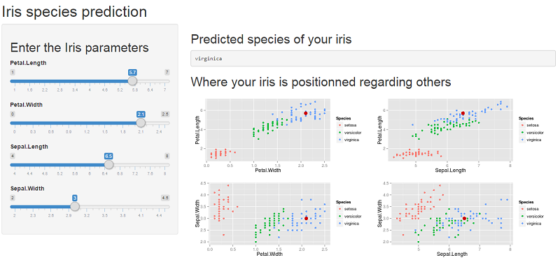

## What is this App?

This DataApp predicts the species of an iris, from several parameters entered by the user: Petal Lenght, Petal Width, Sepal Length, Sepal Width.  

The prediction algorithm has been built by machine learning on the Fisher/Anderson's iris data.  

The user has to enter the parameter of its iris.  
And will get in output the predicted species of the iris.  

Moreover, the user can also see on plots where its iris is positioned regarding other iris of which we know the species.  

---

## How the prediction algorithm has been built?

The prediction algorithm has been built by machine learning on the Fisher/Anderson's iris data.

Here is the R code used to built the prediction algorithm. Note that We have chosen the "Random Forest" method.


```r
##datasets
data(iris);
datainit=iris;
output="Species";

inTrain <- createDataPartition(datainit[,output], p = 0.7, list = FALSE)
training <- datainit[ inTrain,]
testing <- datainit[-inTrain,]

##model
form=Species~.;
method="rf";

modelFit<-train(form=form,data=training,method=method)
```

---

## Prediction model accuracy

The out of sample error have been estimated as a 95% accuracy.

Here is the confusion matrix for this out of sample error estimation.


```r
predictions<-predict(modelFit,newdata=testing)
confusionMatrix(predictions,testing[,output])
```

```
## Confusion Matrix and Statistics
## 
##             Reference
## Prediction   setosa versicolor virginica
##   setosa         15          0         0
##   versicolor      0         15         2
##   virginica       0          0        13
## 
## Overall Statistics
##                                         
##                Accuracy : 0.956         
##                  95% CI : (0.849, 0.995)
##     No Information Rate : 0.333         
##     P-Value [Acc > NIR] : <2e-16        
##                                         
##                   Kappa : 0.933         
##  Mcnemar's Test P-Value : NA            
## 
## Statistics by Class:
## 
##                      Class: setosa Class: versicolor Class: virginica
## Sensitivity                  1.000             1.000            0.867
## Specificity                  1.000             0.933            1.000
## Pos Pred Value               1.000             0.882            1.000
## Neg Pred Value               1.000             1.000            0.938
## Prevalence                   0.333             0.333            0.333
## Detection Rate               0.333             0.333            0.289
## Detection Prevalence         0.333             0.378            0.289
## Balanced Accuracy            1.000             0.967            0.933
```

---

## DataApp user interface

Here is a screenshot of the DataApp user interface:  


---
